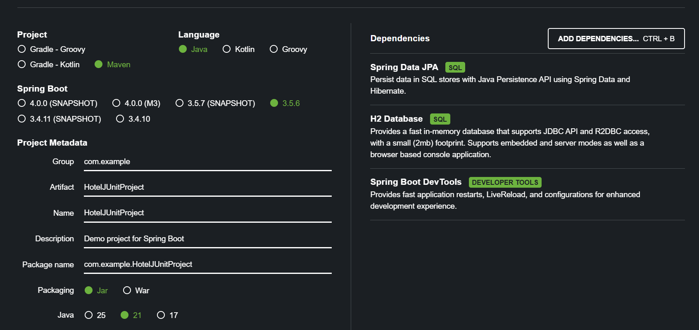

# HotelJUnitProject

## Project Overview
This Spring Boot application demonstrates persisting and managing `Hotel` entities using Spring Data JPA. It includes comprehensive JUnit 5 tests for CRUD operations on the `Hotel` repository.

---

## Project Preview


---

## Project Structure
```
HotelJUnitProject
├── src
│   ├── main
│   │   └── java
│   │       └── com.example.junittest
│   │           ├── Hotel.java          # JPA entity class
│   │           └── HotelRepo.java       # Spring Data JPA repository
│   └── test
│       └── java
│           └── com.example.junittest
│               └── HotelRepoTest.java   # JUnit 5 test class
├── mvnw                            # Maven wrapper script
├── pom.xml                         # Maven configuration
```

---

## Entity and Repository
### Hotel Entity (`Hotel.java`)
```java
package com.example.junittest;

import jakarta.persistence.Entity;
import jakarta.persistence.GeneratedValue;
import jakarta.persistence.GenerationType;
import jakarta.persistence.Id;
import jakarta.persistence.Table;

@Entity
@Table(name = "tbl_hotel")
public class Hotel {

    @Id
    @GeneratedValue(strategy = GenerationType.IDENTITY)
    private int hid;

    private String hname;
    private String haddress;
    private String fitem;

    public Hotel(String hname, String haddress, String fitem) {
        this.hname = hname;
        this.haddress = haddress;
        this.fitem = fitem;
    }

    public Hotel() {
        // Default constructor
    }

    public int getHid() {
        return hid;
    }

    public void setHid(int hid) {
        this.hid = hid;
    }

    public String getHname() {
        return hname;
    }

    public void setHname(String hname) {
        this.hname = hname;
    }

    public String getHaddress() {
        return haddress;
    }

    public void setHaddress(String haddress) {
        this.haddress = haddress;
    }

    public String getFitem() {
        return fitem;
    }

    public void setFitem(String fitem) {
        this.fitem = fitem;
    }
}
```

### Hotel Repository (`HotelRepo.java`)
```java
package com.example.junittest;

import org.springframework.data.jpa.repository.JpaRepository; 

public interface HotelRepo extends JpaRepository<Hotel, Integer>{ 
 
} 
```

This interface provides CRUD operations for `Hotel` entities without boilerplate code.

---

## JUnit Test Cases (`HotelRepoTest.java`)
Annotated with `@DataJpaTest` for configuring an in-memory H2 database and rolling back by default.

```java
package com.example.junittest;

import static org.junit.jupiter.api.Assertions.assertFalse;
import static org.junit.jupiter.api.Assertions.assertTrue;

import java.util.List;

import org.assertj.core.api.Assertions;
import org.junit.jupiter.api.MethodOrderer;
import org.junit.jupiter.api.MethodOrderer.OrderAnnotation;
import org.junit.jupiter.api.Order;
import org.junit.jupiter.api.Test;
import org.junit.jupiter.api.TestMethodOrder;
import org.springframework.beans.factory.annotation.Autowired;
import org.springframework.boot.test.autoconfigure.orm.jpa.DataJpaTest;
import org.springframework.test.annotation.Rollback;

@DataJpaTest
@TestMethodOrder(MethodOrderer.OrderAnnotation.class)
public class HotelRepoTest {

    @Autowired
    private HotelRepo hotelrepo;

    @Test
    @Order(1)
    @Rollback(value = false)
    public void saveHotelTest() {
        Hotel hotel = new Hotel("radisonblue", "mysore", "dosa");
        hotelrepo.save(hotel);
        Assertions.assertThat(hotel.getHid()).isGreaterThan(0);
    }

    @Test
    @Order(2)
    public void getHotelTest() {
        List<Hotel> hotel = hotelrepo.findAll();
        Assertions.assertThat(hotel.size()).isGreaterThan(0);
    }

    @Test
    @Order(3)
    @Rollback(value = false)
    public void updHotelTest() {
        Hotel hotel = hotelrepo.findById(1).get();
        hotel.setFitem("biriyani");
        Hotel newHotel = hotelrepo.save(hotel);
        Assertions.assertThat(newHotel.getFitem()).isEqualTo("biriyani");
    }

    @Test
    @Order(4)
    @Rollback(value = false)
    public void delHotel() {
        boolean beforeDelete = hotelrepo.findById(1).isPresent();
        hotelrepo.deleteById(1);
        boolean afterDelete = hotelrepo.findById(1).isPresent();
        assertTrue(beforeDelete);
        assertFalse(afterDelete);
    }
}
```

---

## Test Output
```
-------------------------------------------------------
 T E S T S
-------------------------------------------------------
Running com.example.junittest.HotelRepoTest
Tests run: 4, Failures: 0, Errors: 0, Skipped: 0

Results:

Tests run: 4, Failures: 0, Errors: 0, Skipped: 0

[INFO] BUILD SUCCESS
```

---

## Conclusion
This project illustrates how to set up Spring Data JPA with an in-memory database and write ordered JUnit tests for essential CRUD operations. The clear structure and minimal boilerplate showcase Spring Boot's productivity features.
